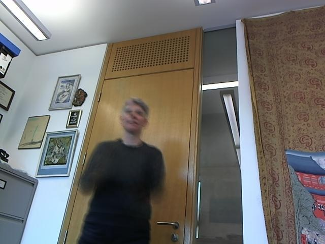

Algorithms Used
===============

The bulk of our system relies on background subtraction and colour thresholding. We have achieved very good performance using only very simple techniques making more complicated techniques like model based skin detection somewhat superfluous. 

For background subtraction, the first attempt was to use the background image provided. However, we soon realized that there were plenty of artifacts resulting from subtle differences between this image and the training set. We investigated the use of normalized RGB, but many of the differences were probably more due to haze, camera jitter and blur.

We found that taking an average over the entire set of images provides a much better result that can be successfully used in background subtraction, with most of the juggler removed from the image. Figure \ref{avgbackground} shows the resulting background image.

<%= render 'docs/avgall.html' %>

When subtracting the background, the difference in pixel colour between a given frame and the averaged background is computed and thresholded for each RGB channel. The threshold values were determined empirically. During this step we also need to preserve colour information since we later detect the balls through colour thresholding. 

<%= render 'docs/bgdiff.html' %> 

Figure \ref{avgnoerosion} shows the result of the background subtraction. Notice that there are still many areas that surface as new foreground, however they are small in area size and can be removed with an erosion operation. Figure \ref{avgerosion} reveals a cleaned up version. A large number of skin pixels are also removed.

Finally we need to identify the balls, and for that we convert the image into the HSV colourspace and threshold on the hue channel. We measured average hues of the balls and chose threshold values in order to detect each of the three balls.

This alone turns out to work remarkably well as discussed below, however to improve performance further, we decided to use our tracking information. One constraint on the domain seems to be that the balls only travel a certain distance in one time step. We measured what that distance is on average and how much it varies from one frame to the next.

. Because this is the case, we only want to look in the region of the image which is a certain distance away from the last position. We decided to set this area to 3 standard deviations of the mean of the distances between successive frames of the true data set (the complete data set fits within 2.5 standard deviation).

This allows us to get rid of some complete misclassifications like detecting the reflection of the ball in the window.

Performance
===========

To evaluate performance two metrics are used. Firstly we count the number of misclassifications, which we define as any detection that is more then 10 pixels away from the true data set. Secondly, we track the average (euclidian) distance from the true data set.

The full system achieves 

The system without the tracking system is slightly worse, but still achieves 

Example images
--------------

By computing the average background over the entire set of frames the following image is obtained used in background subtraction:

Each processing stage, balls, clothing, skin.

Trajectories.

Examples of successful and unsuccessful detections.

TODO

Discussion
==========

One of the problems with using an average image is that if the system should be used as an online system, finding the balls in the first couple of images can be quite difficult. As a simulation of how this behaves we start with the basic background image and as more images come in we iteratively improve our background image. This makes the first roughly five images quite off, but converges quite quickly to fairly smooth detection.

<%= render 'docs/avg_adaptive.html' %>

The results we get from doing this online decrease to 88.215% of detected balls within 10px of true center. 

Source code
===========

<%= render 'docs/main.html' %>