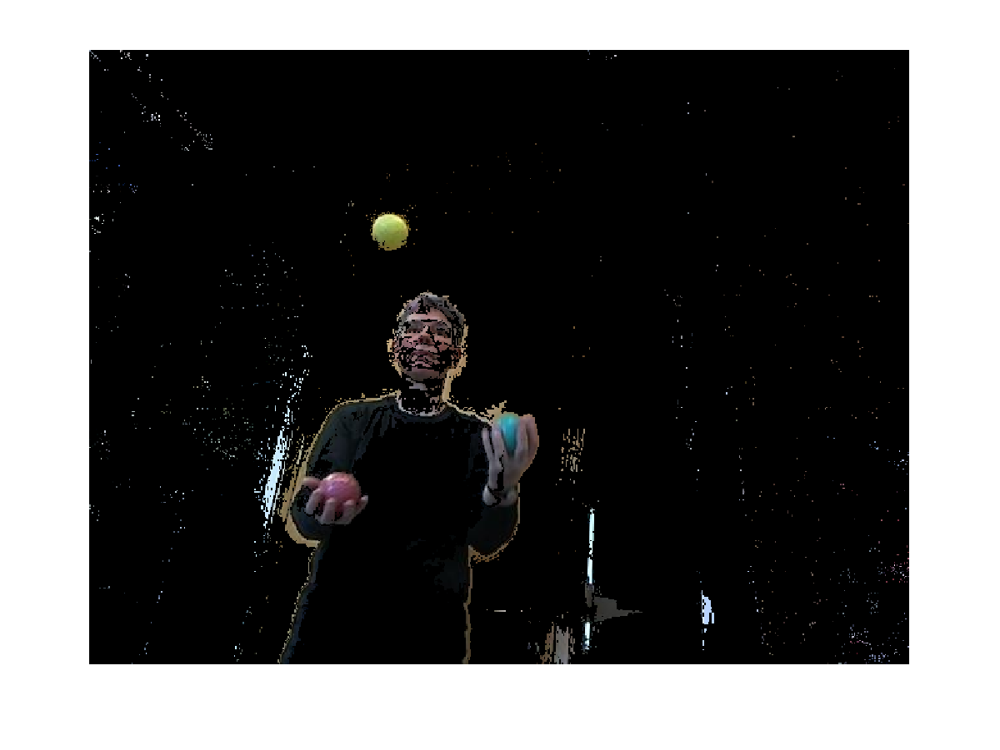
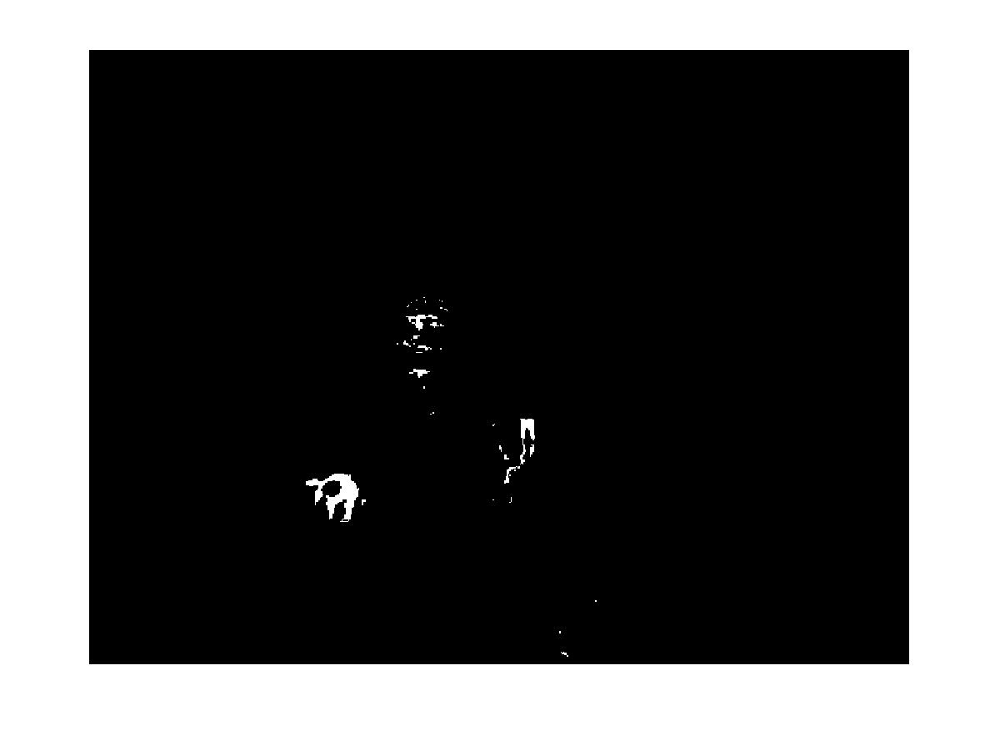

Algorithms Used
===============

The bulk of our system relies on background subtraction and colour thresholding. We have achieved very good performance using only very simple techniques making more complicated techniques like model based skin detection somewhat superfluous. 

For background subtraction, the first attempt was to use the background image provided. However, we soon realized that there were plenty of artifacts resulting from subtle differences between this image and the training set. We investigated the use of normalized RGB, but many of the differences were probably more due to haze, camera jitter and blur.

We found that taking an average over the entire set of images provides a much better result that can be successfully used in background subtraction, with most of the juggler removed from the image. Figure \ref{avgbackground} shows the resulting background image.

<%= render 'docs/avgall.html' %>

When subtracting the background, the difference in pixel colour between a given frame and the averaged background is computed and thresholded for each RGB channel. The threshold values were determined empirically. During this step we also need to preserve colour information since we later detect the balls through colour thresholding. 

<%= render 'docs/bgdiff.html' %> 

Figure \ref{avgnoerosion} shows the result of the background subtraction. Notice that there are still many areas that surface as new foreground, however they are small in area size and can be removed with an erosion operation. Figure \ref{avgerosion} reveals a cleaned up version. A large number of skin pixels is also removed.

Finally we need to identify the balls, and for that we convert the image into the HSV colourspace and threshold on the hue channel, for each ball. We measured average hues of the balls and chose threshold values in order to detect each of the three balls.

This alone turns out to work remarkably well as discussed below, however to improve performance further, we decided to use our tracking information. One constraint on the domain seems to be that the balls only travel a certain distance in one time step, therefore we measured the mean distance and standard deviation for the ground truth set. We used the information in order to extract a region of the image surrounding each ball position in the current frame. We decided to set the area to 3 standard deviations of the mean of the distances between successive frames of the true data set (the complete data set fits within 2.5 standard deviations).

After thresholding is applied, we simply take the biggest blob from the region and compute its centroid. The largest area remaining after the threshold stage corresponds to each of the three balls, since their colour is quite distinct from the rest of the image. Since the threshold is not applied to the entire image, the risk of falsely detecting a ball far away from the expected position is eliminated. This allows us to get rid of some complete misclassifications like detecting the reflection of the ball in the window.

<%= render 'docs/biggest_center.html' %>

Figures \ref{threshred}, \ref{threshyellow} and \ref{threshblue} show the result of applying the threshold on the expected regions for the frame in figure \ref{frame5}.

For visualization, figure \ref{overlaid} illustrates the three thresholding results overlaid.

Performance
===========

To evaluate performance two metrics are used. Firstly we count the number of misclassifications, which we define as any detection that is more then 10 pixels away from the true data set. Secondly, we track the average (Euclidean) distance from the true data set.

The full system achieves 99.327% within 10px of true center (97.980% for the red ball, 100.000% for the yellow ball, 100.000% for the blue ball). Average distance from true center was 1.836px (SD=1.830).

Without using the position tracking history, the system performs slightly worse, but still achieves 97.306% within 10 pixels of true center and in average is 5.975 pixels (SD=36.486799) from the true center.

Figures \ref{unsuccessful1} and \ref{unsuccessful2} illustrate examples for which the error distance is larger than 10 pixels.

Figures \ref{img-tracking-red}, \ref{img-tracking-yellow} and \ref{img-tracking-blue} show the plotted trajectories of each of the red, yellow and blue balls, respectively. Figure \ref{trackingoverlaid} shows the trajectories overlaid.

Discussion
==========

One of the problems with using an average image is that if the system should be used as an online system, finding the balls in the first couple of images can be quite difficult. As a simulation of how this behaves we start with the basic background image and as more images come in we iteratively improve our background image. This makes detection in the first roughly five images rather inaccurate, but converges quite quickly to fairly smooth detection.

<%= render 'docs/avg_adaptive.html' %>

The results we get from doing this online decrease to 88.215% of detected balls within 10px of true center.

The unsuccessful detections illustrated above occur due an inaccurate calculation of the blob centroids, after the thresholding stage. This happens when the balls are partially concealed by the juggler's fingers which deteriorates the visible round shape. In addition, not all skin pixels are removed. A system based on histograms ([1]) or Gaussian models ([2]) could be employed for skin detection. Then, partial shape matching can be performed on the remaining shape for circular segments corresponding to the ball edge, which can be used to better approximate the centroid. 

Appendix: Remaining Source Code
===============================

<%= render 'docs/main.html' %>

Thresholding functions
----------------------

<%= render 'docs/thresh_blue.html' %>
<%= render 'docs/thresh_yellow.html' %>
<%= render 'docs/thresh_red.html' %>

References
==========

[1] Jones, Michael J., and James M. Rehg. "Statistical color models with application to skin detection." In Computer Vision and Pattern Recognition, 1999. IEEE Computer Society Conference on., vol. 1. IEEE, 1999.

[2] Yang, Ming-Hsuan, and Narendra Ahuja. "Gaussian mixture model for human skin color and its application in image and video databases." In Proc. SPIE: Storage and Retrieval for Image and Video Databases VII, vol. 3656, pp. 458-466. 1999.
